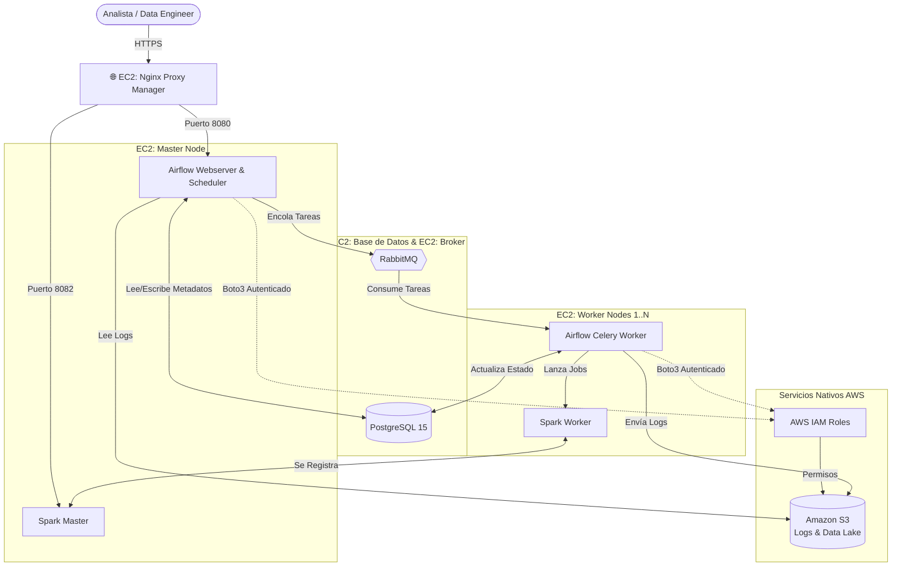

# 🌌 Keppler Financial Risk Cluster

Bienvenido al repositorio de configuración de infraestructura distribuida para **Keppler Data**. Este repositorio contiene la definición como código (Docker Compose) de un clúster analítico de alto rendimiento orquestado con **Apache Airflow 3** y **Apache Spark 4**.

---

## 🏗️ Arquitectura del Sistema

El clúster está diseñado para operar en un entorno distribuido sobre AWS (Amazon Web Services), separando la carga de trabajo en nodos EC2 especializados para garantizar tolerancia a fallos, alta disponibilidad y un rendimiento óptimo en cargas analíticas.

### Diagrama de Componentes



---

## 📦 Topología de Nodos (EC2)

El clúster está dividido lógicamente en los siguientes servicios y repositorios:

1. **Proxy (`proxy/`)**: Puerta de enlace pública. Expone los puertos seguros y maneja los certificados SSL de Let's Encrypt.
2. **Base de Datos (`db/`)**: Instancia de PostgreSQL tuneada para cargas analíticas (`shm_size: 256mb`, `max_connections: 250`). Incluye Adminer para gestión visual.
3. **Broker (`rabbitmq/`)**: Sistema nervioso central del clúster. Recibe las tareas del Scheduler y las reparte a los Workers usando el protocolo AMQP.
4. **Master (`master/` y `spark/master/`)**: El cerebro de la operación. Ejecuta la interfaz de Airflow, el programador de tareas y el administrador principal del clúster Spark.
5. **Workers (`worker/` y `spark/worker/`)**: La fuerza bruta. Múltiples instancias EC2 (ej. 2 Cores / 4GB RAM) optimizadas para autocompletar tareas en paralelo.

---

## 🔐 Integración con AWS (IAM y S3)

La seguridad es primordial. Este clúster ha sido configurado para **no utilizar credenciales hardcodeadas** (`AWS_ACCESS_KEY_ID`). 
En su lugar, los contenedores delegan la autenticación a través de la red nativa usando **AWS IAM Roles** adjuntos a las instancias EC2.

**Persistencia de Logs:**
Airflow está configurado para escribir los logs de ejecución remota directamente en un Bucket de S3 (`s3://logs-kepper/logs/`). Esto permite que el Master lea los logs en tiempo real sin importar qué Worker ejecutó físicamente la tarea.

---

## 📂 Estructura de Directorios y Persistencia

Para evitar la pérdida de datos y garantizar que Docker respete los permisos del sistema operativo (Usuario `ubuntu`, UID `1000`), toda la persistencia se unifica en una carpeta raíz `/home/ubuntu/keppler/data/`.

```text
/home/ubuntu/keppler/
├── cluster-config/              # ESTE REPOSITORIO (Infraestructura Docker)
├── data-platform/               # CÓDIGO FUENTE (DAGs, scripts, pipelines)
└── data/                        # PERSISTENCIA (Montajes de Docker)
    ├── postgres/                # Tablas y datos de la BD
    ├── rabbitmq/                # Mensajes en cola
    ├── proxy/                   # Certificados SSL y base SQLite
    └── spark/                   # Workspaces y logs de Spark
```

---

## 🚀 Secuencia de Despliegue y Arranque

Dado que los componentes dependen entre sí (ej. Airflow no puede iniciar sin una Base de Datos), el orden de encendido es crítico. 

### 1. Preparación de la Máquina Base (En cada nodo)
Antes de ejecutar Docker, crea la estructura física y clona los repositorios para evitar que Docker asuma permisos de `root`:

```bash
# 1. Crear persistencia
mkdir -p /home/ubuntu/keppler/data/{postgres,rabbitmq,proxy/data,proxy/letsencrypt,spark/master/data,spark/master/logs,spark/worker/data,spark/worker/logs}

# 2. Corregir permisos base para Airflow, Spark y Proxy (UID 1000)
sudo chown -R 1000:1000 /home/ubuntu/keppler/data

# 3. 🚨 Excepciones Críticas (Postgres y RabbitMQ requieren sus UIDs internos)
# Si omites este paso, Postgres fallará con "Permission denied" en pg_filenode.map
sudo chown -R 999:999 /home/ubuntu/keppler/data/postgres
sudo chown -R 999:999 /home/ubuntu/keppler/data/rabbitmq

# 4. Clonar código e infraestructura
cd /home/ubuntu/keppler
git clone -b dev https://github.com/keppler-data/financial-analytics-keppler.git data-platform
git clone -b reconfig https://github.com/keppler-data/financial-risk-cluster.git cluster-config
```

### 2. Orden de Encendido (`docker compose up -d`)

Inicia los servicios navegando a sus respectivas carpetas dentro de `cluster-config/` en este orden estricto:

1. **Fase 1 (Cimientos):**
   - `cd db` ➜ `docker compose up -d`
   - `cd rabbitmq` ➜ `docker compose up -d`
2. **Fase 2 (Control):**
   - `cd spark/master` ➜ `docker compose up -d`
   - `cd master` ➜ `docker compose up -d` *(Espera 2 mins a que Airflow migre la BD)*
3. **Fase 3 (Cómputo):**
   - `cd spark/worker` ➜ `docker compose up -d` *(En las EC2 Worker)*
   - `cd worker` ➜ `docker compose up -d` *(En las EC2 Worker)*
4. **Fase 4 (Ingress):**
   - `cd proxy` ➜ `docker compose up -d` *(Conecta los dominios a los puertos 8080 y 8082)*

---
*Desarrollado y optimizado con ❤️ para cargas analíticas distribuidas.*
